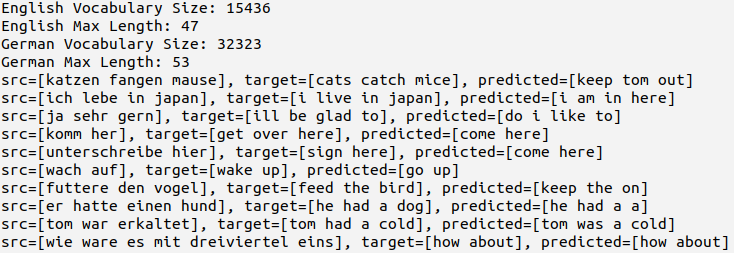
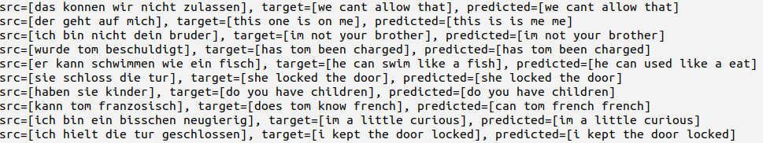
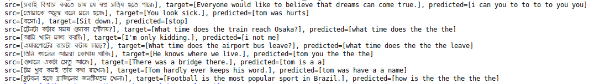

# DeepTranslation
[](#sponsors)
[](#sponsors)
[](#sponsors)
[](#sponsors)
[](#sponsors)

DeepTranslation is a Deep Learning based project for automatic machine translation. 


## Example: German To English Translation
Sample automatic translation result (trained on 10,000 sentence pairs):
<p align="center">
  
</p>


Sample automatic translation result (trained on 50,000 sentence pairs):
<p align="center">
  
</p>

## Example: Bengali To English Translation
Sample automatic translation result (trained on 4,400 sentence pairs):
<p align="center">
  
</p>


## Installation
```
$ git clone https://github.com/pseudoPixels/DeepTranslation.git
$ cd DeepTranslation
$ pip install -r requirements.txt
```


## Download Trained Model
Some pre-trained model can be downloaded from Google Drive using the following commands:
```
curl -L -o model_4400_Ben2Eng.h5  'https://drive.google.com/uc?export=download&id=1oGosApKUsxJKmrCYKOzegJz-pc1elVm7'
curl -L -o model_10000_Ger2Eng.h5  'https://drive.google.com/uc?export=download&id=16B6mClui1ANYsnmYtdaRWrU0JrSdwjr7'
curl -L -o model_50000_Ger2Eng.h5  'https://drive.google.com/uc?export=download&id=1ZAPwQRIP5M7v8k9hX4MroL_KOnfxsxk9'
```

## ToDo
- [x] Train on a larger dataset (50,000 sentence pairs) for German to Egnlish translation.
- [ ] Train on existing larger dataset (1,76,692 sentence pairs) for German to Egnlish translation.
- [ ] Create a larger dataset for Bengali to English machine translation (currently it is only 4400 sentence pairs).
- [ ] User TensorFlow.js with trained model in browser for fun.


## Used Algorithm Explanation
This project on Deep Learning based automatic machine translation was started for experimentations and learning Deep Neural Nets inspired from [Jason Brownlee's tutorial](https://machinelearningmastery.com/develop-neural-machine-translation-system-keras/). Refer to this great tutorial for details of the deep learning algorithms.

## Contributing
:+1::tada: You are most welcome to contribute to this repo.  :tada::+1:

